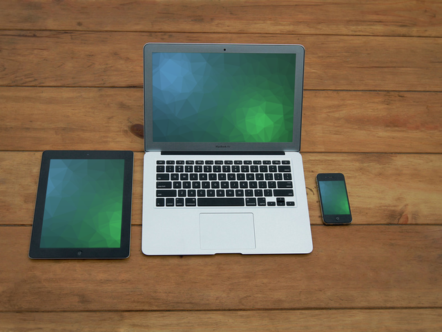
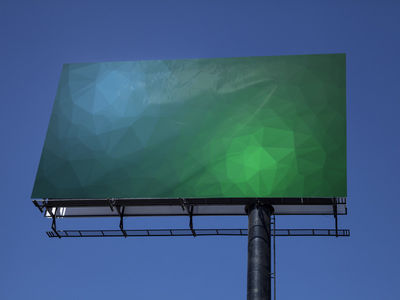
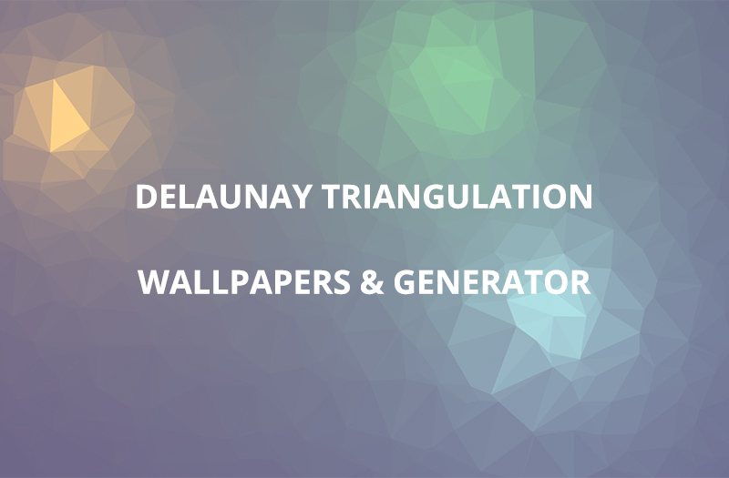
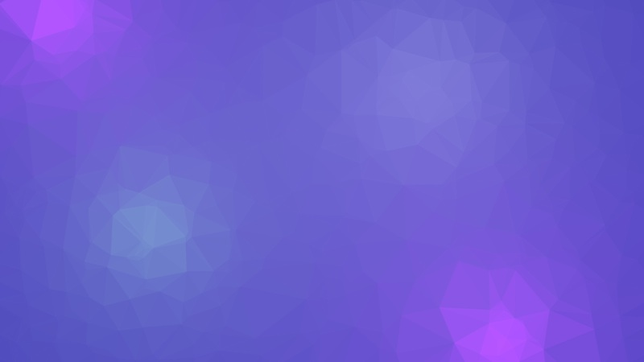
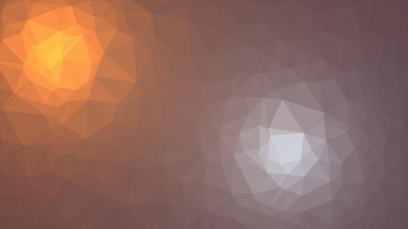
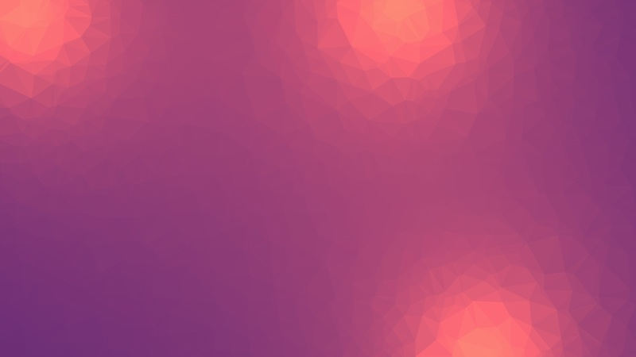
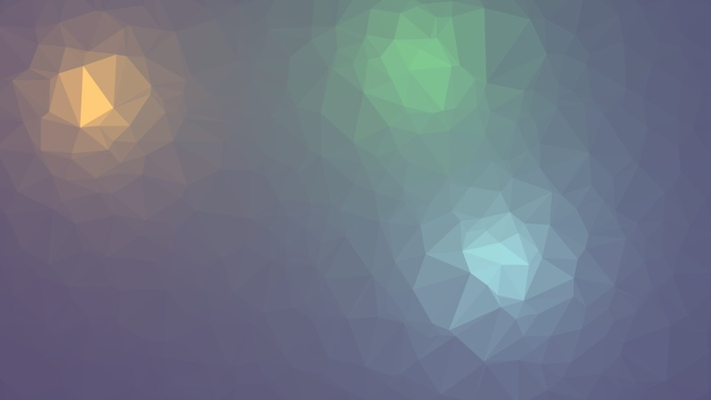
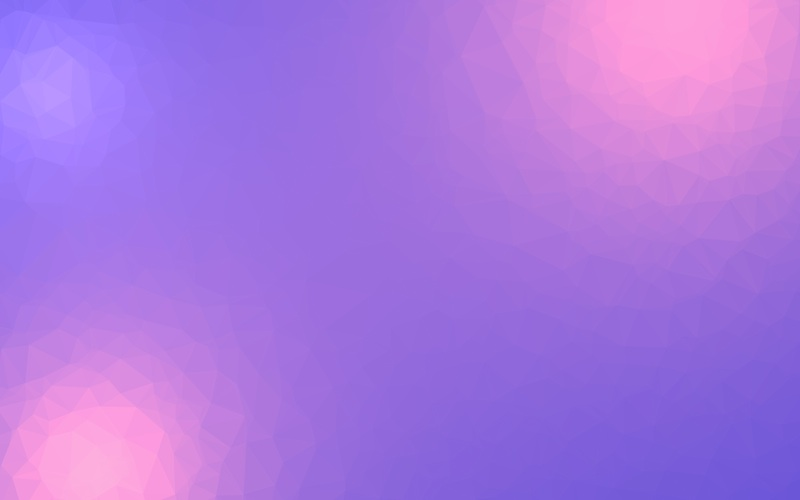
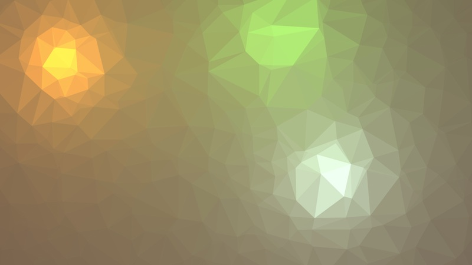
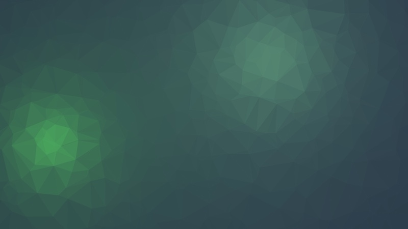

# Triangles

Seeded, renderer-switchable Delaunay backgrounds for the web. The library mounts behind an element's existing content, uses no global state, and produces the same static pattern for the same seed, options, and dimensions.

The interactive playground is deployed from `main` through GitHub Pages.

## What can you make?

Triangles creates high-quality images from Delaunay triangulation and a flat-surface shader. Its patterns have been used for:

- Wallpapers
- Blog post headers
- Magazines
- Posters
- Interfaces and web-page backgrounds

The library provides raster and SVG export primitives. SVG output can be rendered at virtually any size, including billboard-scale artwork.

## Examples

Some of the original project uses:





The original tool in action, creating 11 wallpapers in under 7 minutes: [watch the YouTube demo](https://www.youtube.com/watch?v=JbD-HsmBt_0).

More patterns from the original gallery are kept in this repository. The first image includes a text overlay added in Photoshop.










## Install

```sh
npm install triangles
```

```ts
import TrianglesBackground from 'triangles';

const background = new TrianglesBackground(document.querySelector<HTMLElement>('#hero')!, {
  seed: 'launch-2026',
  renderer: 'auto',
  density: 180,
  depth: 80,
  lights: [
    { ambient: '#8a1b61', diffuse: '#ff9f1c', x: -0.35, y: 0.4, z: 180 }
  ]
});
```

The host retains its content. Triangles makes a static-position host relative and uses an isolated stacking context so the rendered element sits behind its children.

## Browser script

```html
<div id="hero"><h1>Content above the background</h1></div>
<script src="https://unpkg.com/triangles/dist/triangles.iife.js"></script>
<script>
  new Triangles.TrianglesBackground(document.querySelector('#hero'), { seed: 'launch-2026' });
</script>
```

## API

`new TrianglesBackground(host, options)` accepts these options:

- `seed`: string or number used by the local deterministic PRNG.
- `renderer`: `'auto'`, `'webgl'`, `'canvas'`, or `'svg'`. Auto prefers WebGL and falls back to Canvas.
- `density`: triangle-point density calibrated to a 500 by 500 pixel surface.
- `depth`, `meshAmbient`, `meshDiffuse`, and `lights`: surface appearance controls. Light `x` and `y` use a `-1` through `1` coordinate system; `z` is distance from the surface.
- `pixelRatio` and `maxPixelRatio`: output-quality controls. Device pixel ratio is capped at `2` by default.
- `pointer` and `animate`: opt-in interaction and animation. Animation respects reduced-motion preferences.

Instances expose `setOptions`, `setRenderer`, `resize`, `render`, `getOptions`, `getSeed`, `getSnapshot`, `toBlob`, `toSVGString`, and `destroy`.

```ts
background.setRenderer('svg');
const svg = background.toSVGString({ width: 2400, height: 1400 });
const png = await background.toBlob({ width: 2400, height: 1400 });
background.destroy();
```

`toBlob` does not download files. It returns a browser `Blob` so applications can choose their own download, upload, or persistence behavior.

## Development

```sh
npm install
npm run dev
npm run check
npm run build
```

`npm run build:library` produces the NPM package in `dist`. `npm run build:playground` produces the GitHub Pages artifact in `site-dist`.

## Migration from v1

Version 2 is intentionally breaking. The old global `FSS` API, dat.GUI control panel, jQuery dependency, keyboard bindings, and bundled export/download code are removed. Use `TrianglesBackground` as the supported public API.

## Inspiration and credits

The iOS game [Monument Valley](https://www.monumentvalleygame.com/) by [ustwo](https://www.ustwo.com/) inspired the original project, specifically its ocean simulation.

The original shader work was adapted from Matthew Wagerfield's MIT-licensed [Flat Surface Shader repository](https://github.com/wagerfield/flat-surface-shader).

## Author

Maksim Surguy [@msurguy](https://twitter.com/msurguy)

## Releases

Pushing `main` validates and deploys the playground with GitHub Pages Actions. Pushing a `v*` tag whose version matches `package.json` validates and publishes the library to NPM with provenance. Configure the repository's GitHub Pages source as **GitHub Actions** and grant its GitHub Actions identity trusted-publisher access on NPM before the first release.

## Release checklist

Done in the repository:

- [x] v2 migration committed and `main` pushed to origin.
- [x] Legacy v1 sources and demo assets removed (`index.html`, `css/`, `js/`, `source/`, `build/`, `bower.json`, `compositor.json`).
- [x] Release notes captured in [`CHANGELOG.md`](CHANGELOG.md).
- [x] Local browser smoke test passed: `auto`/WebGL/Canvas/SVG switching, seed randomization, PNG and SVG export, deterministic output, and mobile layout (fixed a narrow-viewport overflow in the docs grid).

Remaining maintainer actions (outside this repository):

1. Change the repository's default branch from `master` to `main` in GitHub, then set the Pages source to **GitHub Actions**.
2. Verify the first `Deploy playground` workflow run and its published Pages URL before deleting the remote `gh-pages` branch.
3. Re-run the smoke checks against the deployed Pages URL to confirm parity with local.
4. Configure `triangles` as an NPM trusted publisher for this GitHub repository, then publish the first release by pushing a matching `v2.0.0` tag (the `Publish package` workflow validates and publishes with provenance).

## Future work

- Add automated browser-integration coverage for WebGL fallback, `ResizeObserver`, pointer interaction, reduced-motion animation, and `toBlob` output.
- Add visual-regression coverage for the playground.

## License

MIT. The triangulation approach is based on the original project by Maks Surguy and Flat Surface Shader work by Matthew Wagerfield.
